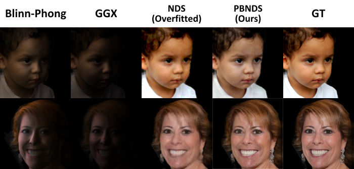

# Physic Based Neural Deferred Shading (PBNDS)

Official PyTorch Implementation



We introduces a novel physics based neural deferred shading pipeline "Physic Based Neural Deferred Shading (PBNDS)" to decompose the data-driven rendering process. The figure provides the quality comparison between different shading models. **Blinn-Phong:** Blinn-Phong shading model; **GGX:** Trowbridge-Reitz GGX model; **NDS:** Neural deferred shader; **PBNDS:** Physics based neural deferred shader; **GT:** Ground truth image. 

## Getting Started
### Installation
#### 1. Prepare the code and the environment
Git clone our repository, creating a python environment and ativate it via the following command：
```
git clone git@github.com:RodneyHe/PBNDS.git
cd pbnds
conda env create -f environment.yml
conda activate pbnds
```

#### 2. Prepare the pretained model
Download and put the pretrained model into pretrained folder \
(Coming soon)

#### 3. Prepare the dataset
Download and put the pretrained model into dataset folder \
(Coming soon)

## Training
<!-- The training of PBNDS contains two stages, training the neural shader and training the nerual shadow estimator. -->
(Coming soon)

## Evaluation
(Coming soon)

